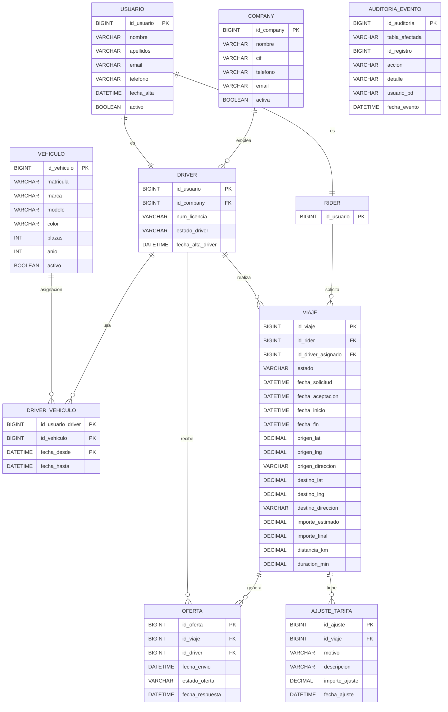

# DESIGN.md

## Diseño de la base de datos Ride Hailing

## 1. Objetivo

El objetivo de esta base de datos es modelar el funcionamiento de una plataforma de ride-hailing similar a Uber, Bolt o Lyft. El sistema permite que un rider solicite un viaje entre dos geolocalizaciones, que la solicitud se envíe a varios conductores y que el primer conductor que acepte quede asignado al viaje. Además, se gestionan empresas, vehículos, ajustes de tarifa, auditoría, métricas y seguridad.

---

## 2. Decisiones de diseño

Se ha optado por un modelo relacional porque el problema tiene entidades bien definidas, relaciones claras y necesidad de consistencia. El sistema debe controlar correctamente viajes, ofertas y concurrencia, por lo que una base de datos relacional resulta adecuada.

Las decisiones principales han sido:

* separar usuarios en una entidad general `usuario` y dos especializaciones: `driver` y `rider`
* asociar cada conductor a una `company`
* modelar la relación entre conductores y vehículos mediante una tabla intermedia `driver_vehiculo`
* almacenar los viajes en la tabla `viaje`
* registrar las ofertas enviadas a conductores en la tabla `oferta`
* guardar modificaciones del precio en `ajuste_tarifa`
* mantener trazabilidad mediante `auditoria_evento`

---

## 3. Modelo Entidad-Relación

El modelo se compone de las siguientes entidades principales:

### 3.1 Company

Representa a la empresa a la que pertenece cada conductor. Una company puede tener varios conductores, pero cada conductor pertenece a una sola company.

### 3.2 Usuario

Contiene la información general de cualquier persona registrada en la plataforma: nombre, apellidos, email, teléfono, fecha de alta y estado.

### 3.3 Driver

Especialización de `usuario` para los conductores. Añade información específica como licencia, estado del conductor y empresa asociada.

### 3.4 Rider

Especialización de `usuario` para los clientes que solicitan viajes.

### 3.5 Vehículo

Guarda los datos de los vehículos disponibles: matrícula, marca, modelo, color, plazas, año y estado.

### 3.6 Driver_Vehiculo

Resuelve la relación N:M entre conductores y vehículos. Permite mantener histórico de asignaciones mediante `fecha_desde` y `fecha_hasta`.

### 3.7 Viaje

Es la entidad principal del sistema. Representa cada trayecto solicitado por un rider. Incluye origen, destino, estado, fechas, conductor asignado, importe estimado, importe final, distancia y duración.

### 3.8 Oferta

Modela las ofertas que se envían a varios conductores cuando se solicita un viaje. Permite registrar aceptación, rechazo o estado pendiente.

### 3.9 Ajuste_Tarifa

Permite registrar cambios en el precio del viaje por motivos como tiempo de espera, cambio de destino, peajes o suplementos.

### 3.10 Auditoria_Evento

Tabla genérica de auditoría para registrar acciones realizadas sobre distintas tablas del sistema.

---

## 4. MER en Mermaid

---

## 5. Justificación de tablas clave

### Viaje

La tabla `viaje` concentra la lógica principal del negocio. Su estado permite seguir el ciclo de vida del trayecto: solicitado, aceptado, en curso, finalizado o cancelado. El `importe_estimado` guarda el precio inicial y el `importe_final` el resultado tras aplicar ajustes.

### Oferta

Es necesaria porque un mismo viaje puede enviarse a varios conductores. Gracias a esta tabla se modela correctamente el requisito de que el primer conductor que acepta se queda el viaje.

### Ajuste_Tarifa

Se añadió porque en plataformas reales el precio puede variar después de solicitar el viaje. Así se puede justificar de forma estructurada cualquier cambio de importe.

### Auditoria_Evento

No se relaciona directamente solo con una tabla, porque su función es auditar múltiples entidades del sistema. Por eso se diseñó como auditoría genérica.

---

## 6. Índices

Se han incluido índices para mejorar el rendimiento de consultas frecuentes. El enunciado lo pide expresamente.

Los índices recomendados son:

* índice sobre `viaje(id_rider)`
* índice sobre `viaje(id_driver_asignado)`
* índice sobre `viaje(estado)`
* índice sobre `oferta(id_viaje)`
* índice sobre `oferta(id_driver)`
* índice sobre `oferta(estado_oferta)`
* índice sobre `ajuste_tarifa(id_viaje)`

Estos índices aceleran búsquedas de viajes por usuario, viajes por estado, ofertas por viaje y ajustes por viaje.

---

## 7. Integridad y consistencia

La base de datos usa claves primarias y foráneas para asegurar integridad referencial. Además:

* se usan restricciones `CHECK` para validar valores
* se usan transacciones para agrupar operaciones relacionadas
* se usa `FOR UPDATE` en concurrencia para asegurar que dos conductores no acepten el mismo viaje a la vez
* se recalcula el importe final a partir del estimado y los ajustes

Esto permite cumplir el requisito de evitar que dos conductores acepten simultáneamente el mismo viaje.

---

## 8. Seguridad

Se han definido distintos usuarios de base de datos con permisos separados:

* `admin_app`: control total
* `operator_app`: operativa del sistema
* `analyst_app`: explotación analítica
* `backup_user`: copias de seguridad
* `readonly_user`: solo lectura

Se sigue así el principio de mínimo privilegio, limitando el acceso a solo lo necesario. El enunciado también exige desarrollar y justificar estos usuarios.

---

## 9. Backup y recuperación

Se ha planteado una estrategia con backups completos, parciales y restauración, además de bloqueo temporal de tablas para asegurar consistencia durante la copia. Esto cubre el requisito del plan de backup y recuperación.

---

## 10. Consultas y dashboard

El proyecto incluye dos grupos de consultas:

* `queries.sql`: operativa del sistema, joins, updates, deletes, transacciones y locks
* `dashboard.sql`: métricas de negocio y monitorización técnica

Con ello se cubren tanto la parte transaccional como la analítica de la práctica.

---

## 11. Posibles mejoras futuras

Como ampliaciones futuras, el sistema podría incorporar:

* sistema de pagos detallado
* valoraciones entre rider y conductor
* promociones y cupones
* zonas geográficas y surge pricing avanzado
* asignación automática por proximidad en tiempo real
* integración con dashboards visuales externos

---

## 12. Conclusión

El diseño propuesto cubre los requisitos funcionales y técnicos del enunciado. La base de datos permite gestionar usuarios, conductores, empresas, vehículos, viajes, ofertas, ajustes, auditoría, seguridad y métricas. Además, el uso de transacciones, índices y locks mejora la consistencia, el rendimiento y la fiabilidad del sistema.
