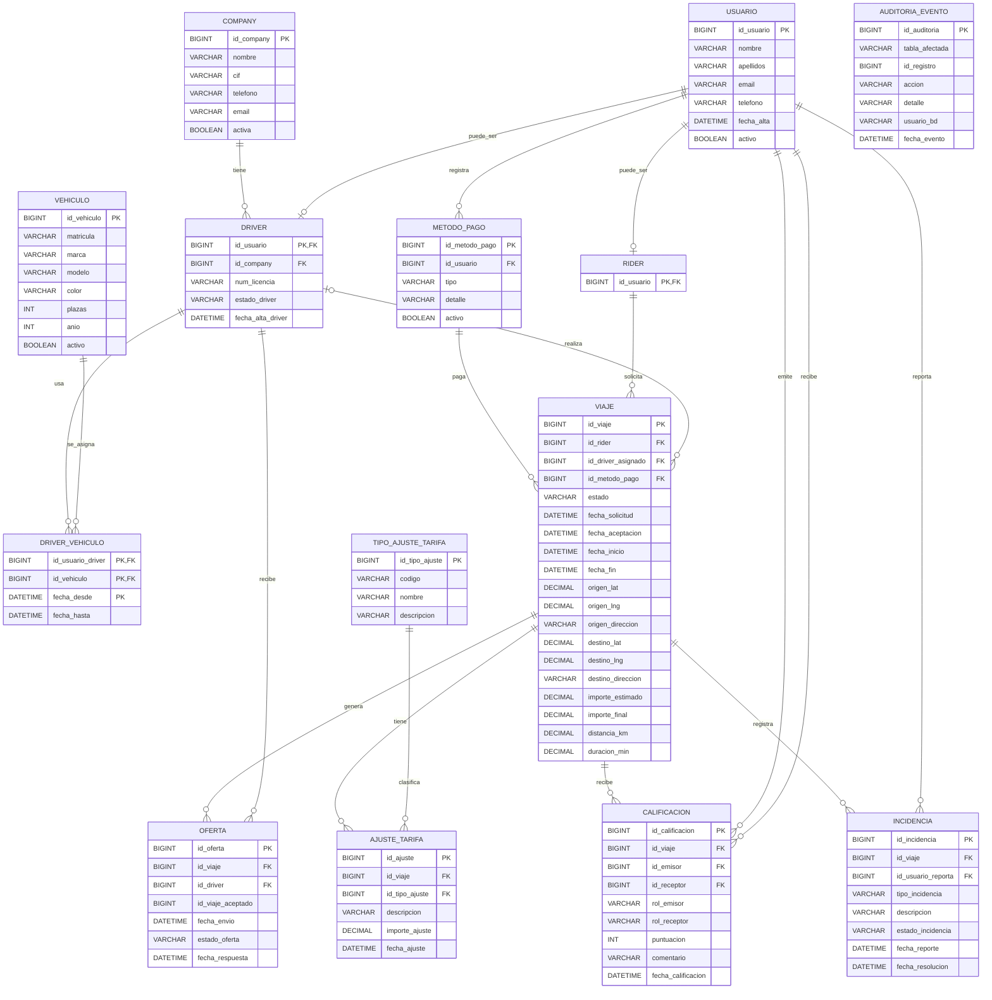

# Modelo entidad-relación

```mermaid
erDiagram

    COMPANY {
        BIGINT id_company PK
        VARCHAR nombre
        VARCHAR cif
        VARCHAR telefono
        VARCHAR email
        BOOLEAN activa
    }

    USUARIO {
        BIGINT id_usuario PK
        VARCHAR nombre
        VARCHAR apellidos
        VARCHAR email
        VARCHAR telefono
        DATETIME fecha_alta
        BOOLEAN activo
    }

    DRIVER {
        BIGINT id_usuario PK, FK
        BIGINT id_company FK
        VARCHAR num_licencia
        VARCHAR estado_driver
        DATETIME fecha_alta_driver
    }

    RIDER {
        BIGINT id_usuario PK, FK
    }

    METODO_PAGO {
        BIGINT id_metodo_pago PK
        BIGINT id_usuario FK
        VARCHAR tipo
        VARCHAR detalle
        BOOLEAN activo
    }

    VEHICULO {
        BIGINT id_vehiculo PK
        VARCHAR matricula
        VARCHAR marca
        VARCHAR modelo
        VARCHAR color
        INT plazas
        INT anio
        BOOLEAN activo
    }

    DRIVER_VEHICULO {
        BIGINT id_usuario_driver PK, FK
        BIGINT id_vehiculo PK, FK
        DATETIME fecha_desde PK
        DATETIME fecha_hasta
    }

    VIAJE {
        BIGINT id_viaje PK
        BIGINT id_rider FK
        BIGINT id_driver_asignado FK
        BIGINT id_metodo_pago FK
        VARCHAR estado
        DATETIME fecha_solicitud
        DATETIME fecha_aceptacion
        DATETIME fecha_inicio
        DATETIME fecha_fin
        DECIMAL origen_lat
        DECIMAL origen_lng
        VARCHAR origen_direccion
        DECIMAL destino_lat
        DECIMAL destino_lng
        VARCHAR destino_direccion
        DECIMAL importe_estimado
        DECIMAL importe_final
        DECIMAL distancia_km
        DECIMAL duracion_min
    }

    OFERTA {
        BIGINT id_oferta PK
        BIGINT id_viaje FK
        BIGINT id_driver FK
        BIGINT id_viaje_aceptado
        DATETIME fecha_envio
        VARCHAR estado_oferta
        DATETIME fecha_respuesta
    }

    TIPO_AJUSTE_TARIFA {
        BIGINT id_tipo_ajuste PK
        VARCHAR codigo
        VARCHAR nombre
        VARCHAR descripcion
    }

    AJUSTE_TARIFA {
        BIGINT id_ajuste PK
        BIGINT id_viaje FK
        BIGINT id_tipo_ajuste FK
        VARCHAR descripcion
        DECIMAL importe_ajuste
        DATETIME fecha_ajuste
    }

    CALIFICACION {
        BIGINT id_calificacion PK
        BIGINT id_viaje FK
        BIGINT id_emisor FK
        BIGINT id_receptor FK
        VARCHAR rol_emisor
        VARCHAR rol_receptor
        INT puntuacion
        VARCHAR comentario
        DATETIME fecha_calificacion
    }

    INCIDENCIA {
        BIGINT id_incidencia PK
        BIGINT id_viaje FK
        BIGINT id_usuario_reporta FK
        VARCHAR tipo_incidencia
        VARCHAR descripcion
        VARCHAR estado_incidencia
        DATETIME fecha_reporte
        DATETIME fecha_resolucion
    }

    AUDITORIA_EVENTO {
        BIGINT id_auditoria PK
        VARCHAR tabla_afectada
        BIGINT id_registro
        VARCHAR accion
        VARCHAR detalle
        VARCHAR usuario_bd
        DATETIME fecha_evento
    }

    COMPANY ||--o{ DRIVER : tiene

    USUARIO ||--o| DRIVER : puede_ser
    USUARIO ||--o| RIDER : puede_ser

    USUARIO ||--o{ METODO_PAGO : registra
    METODO_PAGO ||--o{ VIAJE : paga

    DRIVER ||--o{ DRIVER_VEHICULO : usa
    VEHICULO ||--o{ DRIVER_VEHICULO : se_asigna

    RIDER ||--o{ VIAJE : solicita
    DRIVER o|--o{ VIAJE : realiza

    VIAJE ||--o{ OFERTA : genera
    DRIVER ||--o{ OFERTA : recibe

    VIAJE ||--o{ AJUSTE_TARIFA : tiene
    TIPO_AJUSTE_TARIFA ||--o{ AJUSTE_TARIFA : clasifica

    VIAJE ||--o{ CALIFICACION : recibe
    USUARIO ||--o{ CALIFICACION : emite
    USUARIO ||--o{ CALIFICACION : recibe

    VIAJE ||--o{ INCIDENCIA : registra
    USUARIO ||--o{ INCIDENCIA : reporta
```